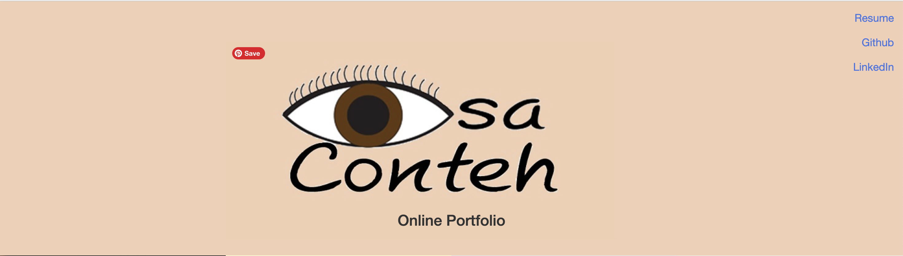
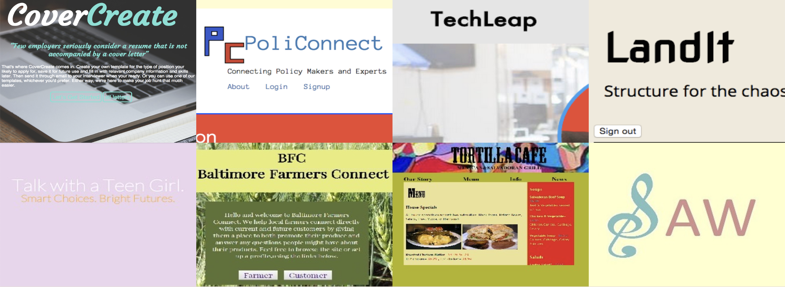
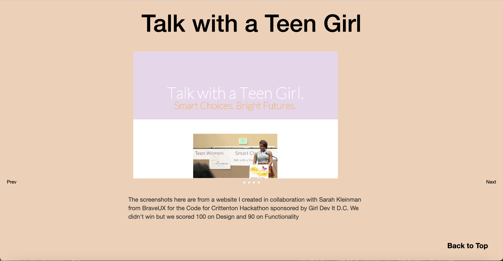

# Personal Portfolio site

## Current Site Updates (2025 - full scale redesign)
Updates include:
- Making site more secure by moving from http to https (completed)
- Converting static site to a react project (in progress)
- Updating content to include experience (old projects will be removed - planned)
- Design update (planned)

## Second Portfolio Update (2018)
Portfolio was moved off of the original host site and instead hosted and deployed by github pages.

## Portfolio Update (2016)
The jquery woothemes slider was replaces by the Unslider because the former was deprecated.

## Original Site details (released Fall 2014)
Description:
This was initially a website created at the very beginning of my programming journey (before I joined General Assembly's Web Developement Immersive Program and before I started working professionally in software engineering) in order to show case my then, brand new programing skills. 

It was a static site that did not run on any engine and was hosted by a long forgotten site/company. The domain was purchased from [godaddy.com](https://www.godaddy.com/).

Because I had pretty much no work experience at the time, this particular site was designed to showcase projects I'd worked on in various other settings including side projects, sites created in hackathons and eventually in the bootcamp program I completed roughly 6 months later.

Tools used included:
- HTML
- CSS
- Javascript
- JQuery

The logo at the top of the page was an old custom made one I created not long after getting out of college. The header also included links to an interactive resume (buttons were used to show text), my github profile and my LinkedIn page.

Below that were enlarged thumbnails that served as anchor links to parts of the page that contained more information about whatever project the images were associated with. 

The thumbnails were also hoverable and would show text with a short description of what the project was about. Below shows what the "LandIt" page thumbnail looked like when hovered over.

Each further detailed section included: 
 - a title
 - a default image
 - a slider that allowed the user to view screenshots of multiple parts of the site
 - a longer description, a link to the site if it was live
 - and a link back to the top of the site

 

 
